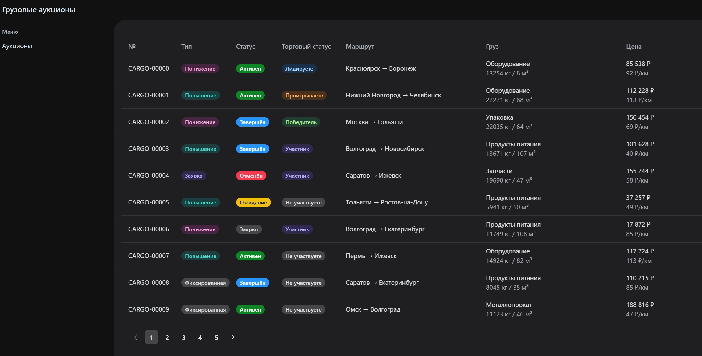

# Cargo Auctions



Проект можно посмотреть по ссылке: <a href="https://davidsulava.github.io/Cargo_Auctions/?cargo_num=&statuses=%5B%5D&load_city=&unload_city=&load_date_from=&load_date_to=&page=1&per_page=10" target="_blank" rel="noopener noreferrer">GitHub Pages</a>

SPA для грузовых аукционов. React 19 + TypeScript + TanStack Router/Query + RHF + Zod + MSW + Astryx + Tailwind v4 + Docker.

## Стек

| Категория | Библиотека |
|-----------|-----------|
| Ядро | React 19, TypeScript 6 |
| Сборка | Vite 8 |
| Маршрутизация | TanStack Router |
| Запросы | TanStack Query |
| Формы | React Hook Form + Zod |
| UI-kit | Astryx + Tailwind v4 (bridge) |
| Mock API | MSW |
| Тесты | Vitest, Playwright |

## Разработка

```bash
npm install
npm run dev        # dev-сервер на :3000
npm run build      # typecheck + production build
npm run test       # unit-тесты (vitest)
npm run test:e2e   # e2e-тесты (playwright)
npm run lint       # oxlint
```

## Docker

```bash
docker compose up    # nginx со статикой на :8080
```

## Переменные окружения

| Переменная | По умолчанию | Описание |
|-----------|-------------|----------|
| `VITE_API_BASE` | `/api` | Префикс API-запросов |

## Архитектура (FSD)

```
src/
├── app/          # провайдеры, роутер, стили
├── entities/     # типы аукционов и ставок
├── pages/        # страницы (список, детальная, ставки, форма ставки)
├── shared/       # API-клиент, MSW, утилиты
└── widgets/      # переиспользуемые UI-блоки (фильтры, таблица, форма ставки)
```
